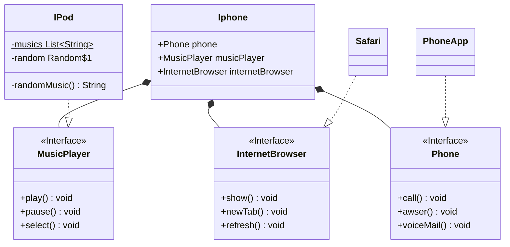

# Introdução
Nesse desafio a ideia foi considerar o navegador, telefone e reprodutor musical como aplicativos, dessa forma a melhor relação que temos para representação UML e a de composição que foi feita com a classe **Iphone**, ela representa o mínimo que um iphone precisa ter disponível que no caso sao os aplicativos **InternetBrowser**, **MusicPlayer** e **Phone**.

A escolha dos aplicativos serem tratados como interfaces foi para que possam ser criadas aplicações compostas, por exemplo um navegador de internet que seja também um player de música, isso fica mais claro quando criamos algo como **MediaPlayer** que pode ser um **MusicPlayer** e **VideoPlayer**, isso também permite seguir o princípio Interface Segregation do SOLID.

Dessa forma a classe **Iphone** funciona como um agregador de aplicativos que podem ser acessados por suas propriedades públicas, onde é feita "herança" via composição. A escolha da classe Iphone não ser abstrata foi pela não necessidade de trabalhar com múltiplas versões de Iphones no código.

Obs: Não foi inserido no diagrama UML do projeto a classe **Menu** ela é uma classe auxiliar para que seja possível interagir com o objeto iphone pelo console (terminal).

# Diagrama

